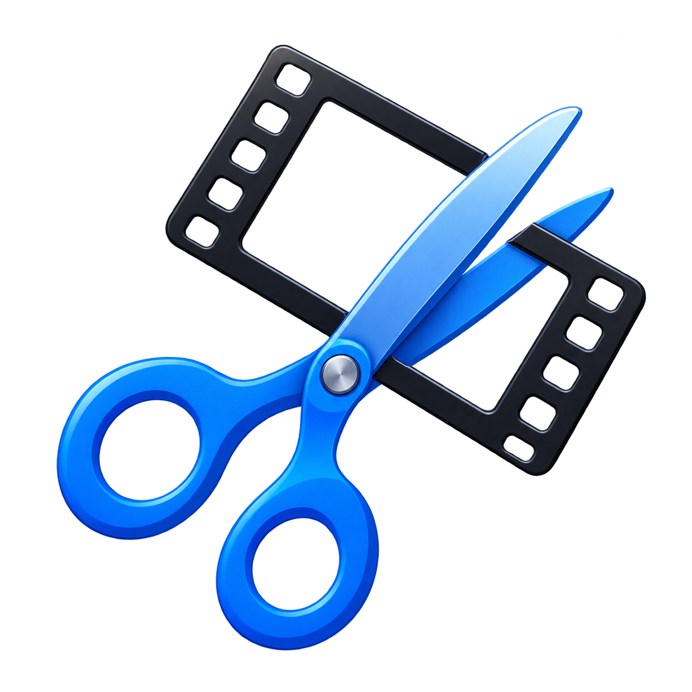

<p align="center">
  
</p>

<h1 align="center">Post</h1>

<p align="center">
  A free Windows desktop editor for video, audio, images, graphics, and GIFs.
</p>

<p align="center">
  <a href="https://github.com/kl3mta3/Post/releases/latest"><strong>Download Post</strong></a>
  ·
  <a href="https://post.lastweeksproject.com">Website</a>
  ·
  <a href="https://github.com/kl3mta3/Post/issues">Report a problem</a>
</p>

Post is designed for quick editing without hiding useful timeline controls. Import media, arrange it on independent layers, add animated graphics, preview the composition, and export through the included FFmpeg media engine.

## Install Post

Post currently supports 64-bit Windows 10 and Windows 11.

1. Open the [latest Post release](https://github.com/kl3mta3/Post/releases/latest).
2. Download the file named `Post-Setup-x.x.x.exe` from **Assets**.
3. Run the installer.
4. Choose whether to create a desktop shortcut, then finish the installation.
5. Open **Post** from the Start menu or desktop shortcut.

Post installs for the current Windows user by default and registers `.post` project files so they can be opened from File Explorer. FFmpeg and ffprobe are included with the installer; users do not need to install them separately.

> [!NOTE]
> Early community builds may not be code-signed. If Windows SmartScreen appears, confirm that the installer came from this repository's Releases page before choosing **More info → Run anyway**.

### Updating

Open **Help → Check for Updates** inside Post. The app checks `https://download.post.lastweeksproject.com` and downloads a newer version when one is available. You can also install a new release over the existing installation; your projects and settings remain in place.

## Make your first project

1. Select **File → New Project**.
2. Click the **＋** button in **Media**, or drag supported files into Post.
3. Drag one or more Media items into the Layers area. Each item dropped into empty space gets an appropriate video, audio, or graphics layer.
4. Move the white edit caret to choose an edit position. When playback is stopped, the preview shows the composition frame at that position.
5. Drag clips to arrange them. Press `C` to split the selected clip at the white caret.
6. Add text, an image, a solid color, or a gradient with **＋ Graphic**.
7. Press `Space` to preview the project.
8. Choose **Export Video**, **Export Audio**, or configure the result through **Export Settings**.
9. Save the editable project with **File → Save**. Post project files use the `.post` extension and reference the original media without modifying it.

## What Post can do

### Timeline editing

- Independent, reorderable video, audio, and graphics layers.
- Rename, resize, show/hide, mute, move, duplicate, and delete layers.
- Duplicate an entire layer or copy one clip to a new layer at the same project time.
- Split, trim, remove, copy, paste, and reposition clips without changing source files.
- Visual clip movement, endpoint snapping, and overlap-aware placement.
- Zoom-aware video filmstrips and detailed audio waveforms.
- Separate left/right waveform rows and `L`, `R`, or `L&R` channel muting for audio layers.
- Adjustable project working time, including optional black tail rendering.
- Undo and redo for timeline and project edits.

### Preview and navigation

- Red playback caret and independent white editing caret.
- Current-frame preview while scrubbing, including before the project has been played.
- Full-project, single-layer, single-clip, and Media-bin previews.
- Frame stepping, five-second jumps, looping, preview volume, and mute controls.
- Project/source timestamp display when hovering over a selected clip.
- Timeline zoom that regenerates detailed thumbnails and waveforms instead of enlarging blurry images.
- Resizable Media, preview, timeline, and layer-header areas.

### Graphics

The **＋ Graphic** menu creates:

- Text using installed Windows fonts, with font previews, size, text color, background, and opacity.
- Images with optional aspect-ratio locking.
- Solid-color cards.
- Linear or radial two-color gradients with an optional second color and adjustable angle.

Graphics begin at the white edit caret and normally receive their own layer. They can be moved, resized, trimmed, extended, duplicated, snapped to 25%/50%/75% alignment guides, and animated with keyframes.

### Keyframes and effects

- Animate Position X, Position Y, Scale, Opacity, and Volume.
- Linear, Discrete/Hold, and Smooth interpolation.
- Signed values for movement in either direction.
- A dedicated property-row keyframe timeline with frame-by-frame mouse-wheel and arrow-key navigation.
- Configurable Fade In, Fade Out, Slide In, Zoom In/Out, and Audio Fade In/Out effects.
- Effects generate editable keyframes rather than permanent black-box changes.

### Export

- Export a complete layered video composition.
- Export audio only while ignoring visual layers.
- Lossless stream-copy mode when the requested operation supports it.
- Encoded output with adjustable quality, audio bitrate, speed, and volume.
- 20 MB, 10 MB, and custom-size targets.
- Animated GIF export, including quick GIF creation from a selected clip (up to the first 15 seconds).
- Source-resolution PNG screenshots copied to the Windows clipboard.

## Supported formats

### Import

| Type | Formats |
|---|---|
| Video | MP4, MKV, MOV, WebM, AVI, WMV, FLV, M4V |
| Audio | MP3, WAV, M4A, AAC, FLAC, OGG, OPUS, WMA |
| Image | PNG, JPG/JPEG, WebP, BMP, GIF, TIF/TIFF |

### Export

| Type | Formats |
|---|---|
| Video | MP4, MKV, MOV, WebM, AVI, animated GIF |
| Audio | MP3, M4A, WAV, FLAC, OGG |
| Screenshot | PNG |

Actual codec availability and lossless compatibility depend on the source streams and selected container. Post automatically encodes when an operation—such as cropping, speed adjustment, overlays, effects, or exact visual composition—cannot be performed as a stream copy.

## Keyboard shortcuts

| Shortcut | Action |
|---|---|
| `Space` | Play or pause |
| `←` / `→` | Step the white edit caret one frame |
| `Shift+←` / `Shift+→` | Jump five seconds |
| `Home` / `End` | Go to project start/end |
| `I` or `[` | Set source IN point |
| `O` or `]` | Set source OUT point |
| `C` or `V` | Split the selected placed clip |
| `X` | Remove the selected placed clip |
| `Delete` | Delete the selected timeline item |
| `Ctrl+X` / `Ctrl+C` / `Ctrl+V` | Cut, copy, or paste the selected item |
| `Ctrl+Z` / `Ctrl+Shift+Z` | Undo or redo |
| `Ctrl` + mouse wheel | Zoom the layer timeline |
| `P` | Capture a screenshot |
| `L` or `Shift+Space` | Toggle loop playback |
| `M` | Mute or unmute preview audio |
| `R` or `Escape` | Reset source markers and pending cuts |
| `Ctrl+N` | New project |
| `Ctrl+O` | Open project |
| `Ctrl+S` | Save project |
| `Ctrl+Shift+S` | Save project as |
| `Enter` | Export video |
| `Ctrl+,` | Open Settings |

## Troubleshooting

### A project opens but its media is missing

`.post` files store references to the original media rather than embedding copies. Restore the files to their previous locations or re-add them from their new locations.

### Lossless output starts slightly before the selected frame

Lossless stream copying can only begin on an encoded video keyframe. Choose an encoded export mode when the starting frame must be exact.

### A format imports but cannot play directly through Windows

Post creates compatible preview proxies for Windows playback when necessary. The original file remains untouched and FFmpeg still uses it for the final export.

### Update checking fails

Confirm that Windows can reach `https://download.post.lastweeksproject.com` over HTTPS and that a firewall or security product is not replacing or blocking the connection. Releases can always be downloaded manually from the [GitHub Releases page](https://github.com/kl3mta3/Post/releases/latest).

## Build from source

Requirements:

- Windows 10 or Windows 11 (64-bit)
- [.NET 8 SDK](https://dotnet.microsoft.com/download/dotnet/8.0)
- FFmpeg and ffprobe in `PATH` or in a `tools` directory beside the built application

Clone and run:

```powershell
git clone https://github.com/kl3mta3/Post.git
cd Post
dotnet run --project src/Post.App/Post.App.csproj --configuration Release
```

Build and test:

```powershell
dotnet build Post.slnx --configuration Release
dotnet run --project tests/Post.Tests/Post.Tests.csproj --configuration Release
```

Create a self-contained 64-bit Windows build:

```powershell
dotnet publish src/Post.App/Post.App.csproj --configuration Release --runtime win-x64 --self-contained true --output dist/Post
```

The test runner generates real video, audio, and image fixtures and validates probing, preview proxies, trimming, formats, layered exports, keyframes, project persistence, duplication, and update behavior end to end.

## License

Post is distributed under the terms in [LICENSE.md](LICENSE.md). Third-party component notices are listed in [THIRD_PARTY_NOTICES.md](THIRD_PARTY_NOTICES.md).
